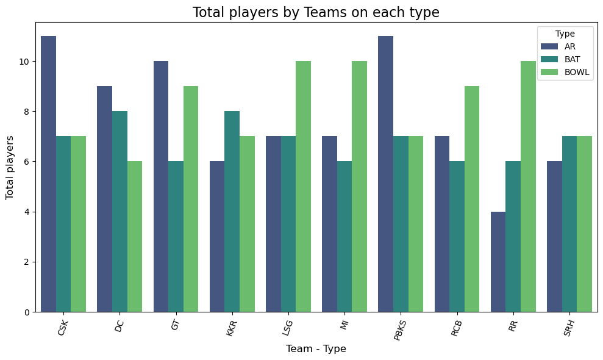
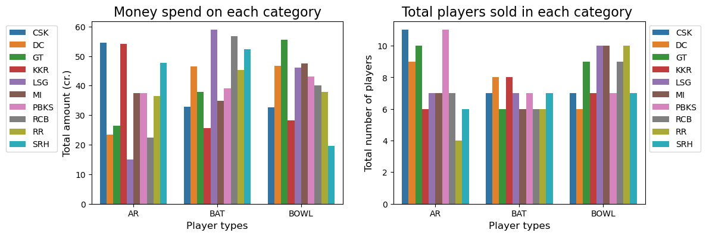

# IPL 2025 Auction Data Analysis

## 1. Introduction
This project focuses on the web scraping and analysis of data from the IPL 2025 Auction. The goal was to extract key insights about player selections, team strategies, and financial trends in the auction process. By leveraging data science techniques, the project aims to uncover actionable insights and trends.

## 2. Background
The Indian Premier League (IPL) is one of the most celebrated cricket leagues globally, attracting top talent and massive viewership. The 2025 Auction marked a significant event, with teams competing to acquire players while balancing their budgets and strategies. This project seeks to analyze the auction dynamics to understand team compositions, player valuations and other critical aspects.

## 3. Tools I Used
### Programming Languages:
- **Python**: For web scraping, data analysis and visualization.

### Libraries and Frameworks:
- **requests**: To fetch HTML content from websites.
- **BeautifulSoup**: For parsing and extracting data from HTML.
- **pandas**: For data cleaning and manipulation.
- **matplotlib** and **seaborn**: For creating visualizations.

## 4. The Analysis
### Web Scraping:
- Extracted auction data, including player names, teams, base prices, sold prices, and roles, from publicly available sources.
- Used `requests` and `BeautifulSoup` to navigate HTML structures and collect relevant information.

### Data Processing:
- Cleaned and structured the data into a tabular format using `pandas`.
- Addressed missing values and standardized the dataset for analysis.

### Exploratory Data Analysis (EDA):
- Visualized team-wise spending to understand budget allocations.
- Analyzed player categories (batsman, bowler, all-rounder) and their demand.
- Identified trends in player valuations, comparing base price vs. sold price.

### Points to Analysis:
1. Which team has spent more money and on which type of players?
2. What was the trend of spending money by all teams?
3. Who has got the highest money in the auction?
4. Analyze every team’s spending pattern.
5. Analyze every category of players who has got more money and who has got less money in the auction.

#### Example Insights:
- **Which team has spent more money and on which type of players?**
  - **Answer**: CSK has spent more money among all teams and they have spent 18 cr. on Ruturaj Gaikwad.
- **What was the trend of spending money by all teams?**
  - **Answer**: Check the bar graph below.
- **Who has got the highest money in the auction?**
  - **Answer**: Rishabh Pant.
- **Analyze every team’s spending pattern?**
  - **Answer**: Check the bar graph below.
- **Analyze every category of players who has got more money and who has got less money in the auction?**
  - **Answer**: Check the graph below.

### Visualizations:
#### Total Spend by Teams on each type

#### Total players by Teams on each type

#### Money spent on each category and Total players sold in each category

## 5. Conclusions
- **Team Spending**: Certain teams prioritized specific player roles, indicating strategic preferences.
- **Player Demand**: All-rounders were highly sought after, often exceeding their base price significantly.
- **Budget Utilization**: Most teams utilized their budgets effectively, leaving minimal unused funds.
- **Future Scope**: The analysis could be extended to predict player values and team strategies in future auctions.

This project highlights the power of data analytics in understanding complex systems like IPL auctions and provides valuable insights for teams, analysts, and fans alike.
